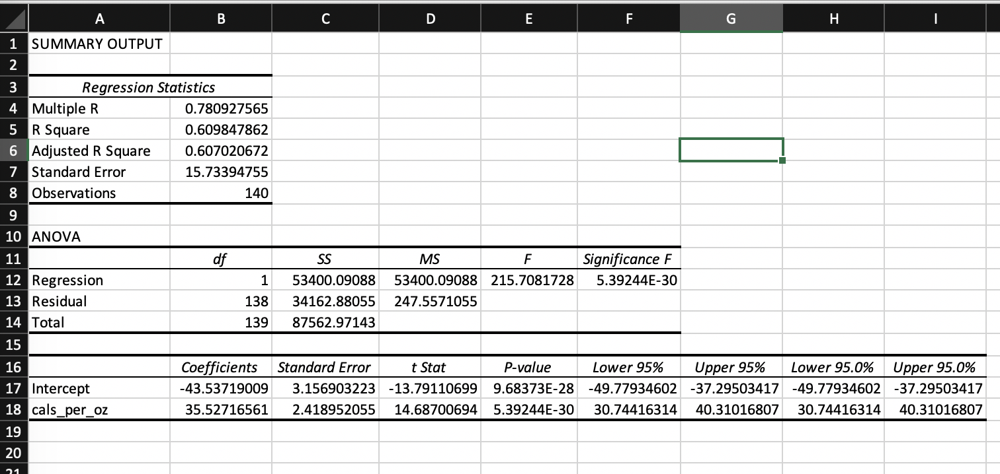

```{r include = F}
knitr::opts_chunk$set(message = FALSE, warning = FALSE, fig.align='center')
```
***

## **Question 1 (15 points):** 
#### **Please refer to “heart” data in package “catdata”. We want to compare the adiposity between heart disease and no heart disease.**

Loading data:
```{r}
library(catdata)
library(dplyr)
data(heart)
```
***

### **(1)** 
#### **Plot a box plot to show the adiposity between heart disease and no heart disease. Do these two groups have different distributions of adiposity in terms of mean and range? Briefly describe what you find in this box plot.**

```{r}
heart_df = data.frame(heart)
summary(heart_df)

boxplot(data=heart_df,
		adiposity ~ y,
		main="Adiposity between heart disease and no heart disease",
		xlab = "Heart Disease",
		names = c("No", "Yes"))
  
```

The group with heart disease has a distribution of adiposity scores that shows higher scores at every quartile. The mean adiposity score is higher in the group with heart disease, and the range of adiposity scores is smaller for the heart disease group.

***

### **(2)** 
#### **Do a pooled T-test and see if the means of adiposity between two groups are significantly different. What is the null hypothesis? What is the p-value and what is the 95% confidence interval?**

```{r}
t.test(x = subset(heart_df$adiposity, heart_df$y==1),
		y = subset(heart_df$adiposity, heart_df$y==0),
		alternative = "two.sided",
		conf.level = 0.95,
		var.equal = T)
```
Null hypothesis: **$H_0: \mu_0 - \mu_1 = 0$**\
p-value: **3.051e-08**\
95 percent confidence interval: **2.703560  5.598728**\

***
### **(3)** 
#### **Do a F test to see if the variances of adiposity between two groups are significantly different if we use $\alpha=0.05$. What is the null hypothesis? What is the p-value and what is the 95% confidence interval?**

```{r}
var.test(x = subset(heart_df$adiposity, heart_df$y==1),
			y = subset(heart_df$adiposity, heart_df$y==0),         
			alternative = "two.sided", 
			conf.level = 0.95)
```
***
Null hypothesis: **$H_0: \sigma_1^2 = \sigma_2^2$**\
p-value: **0.1734**\
95 percent confidence interval: **0.6314759  1.0891395**\

## **Question 2 (15 points):** \
#### **Please refer to “birth” data in package “catdata”. Only use the data where the country is France. We want to know if the weight of babies has the association with cesarean or not in France. **
***

```{r}
# install.packages(c("ggpubr"))
library(ggpubr)
data(birth)
FrenchBabes = filter(birth, Country == 'FR')
```


### **(1)** 
#### **Add a new column “BWeightG” to group to babies’ weights into three groups: $Weight \le 2500 g$, $2500 g < Weight \le 4000 g$, and $Weight > 4000 g$.**

```{r}
FrenchBabes %>%
  mutate(BWeightG = case_when(Weight <= 2500 ~ '(0, 2500]', 
                            Weight > 2500 & Weight <= 4000 ~ '(2500, 4000]', 
                            Weight > 4000 ~ '(4000, inf)')) -> FrenchBabes
```

***

### **(2)** 
#### **Plot a stacked bar plot where x axis is the baby weight’s group $(\le 2500$, $(2500, 4000]$, and $> 4000)$, and y axis is the number of babies who are were born by cesarean. Brief describe what you find in the bar plot.**

```{r}
FrenchBabes$Cesarean = as.factor(FrenchBabes$Cesarean)
ggplot(FrenchBabes, aes(x = BWeightG, fill = Cesarean)) + 
  geom_bar(position = "stack") +
  scale_fill_discrete(name = "Cesarean", labels = c("No", "Yes")) +
  ggtitle("Number of babies born by weight and delivery method")

```
The majority of babies born are delivered without a cesarean section, and the majority of babies born weigh between 2500 and 4000 grams. It also appears that a cesarean section is most likely when babies weigh less than 2500 grams at birth.

***
### **(3)** 
#### **Do a Chi-square test to see if the association between baby’s weight group and cesarean is significant if we use $\alpha=0.05$. Show the observed table and the expected table. What is the degrees of freedom? What is the p-value?**

```{r}
chi = chisq.test(FrenchBabes$BWeightG, FrenchBabes$Cesarean)
chi
chi$observed
chi$expected
```
The association between baby's weight and cesarean is significant with $\alpha=0.05$.
The degrees of freedom is df = 2.  
The p-value is 3.931e-06. 

***

## **Question 3 (10 points):** 
#### **Please refer to “diet_data” which was posted on Blackboard. We want to see if consuming wine and weight-based exercise would affect the means of weight changes. Before the analysis, be sure to delete the rows with missing value in column “change”.**

***
Preprocessing
```{r}
diet_data = read.csv("C:/Users/jerem/Downloads/diet_data.csv")
diet = diet_data[!is.na(diet_data$change),] # [row, columns]
```

### **(1)** 
#### **Plot a box plot with points representing the means to show the distribution of (1) weight changes (change) of consuming wine (wine) without weight-based exercise (weight), (2) consuming wine with weight-based exercise, (3) not consuming wine without weight-based exercise and (4) not consuming wine with weight-based exercise. Briefly describe what you find in the box plot.**

```{r}
summary(diet)
wine_yes = filter(diet, diet$wine==1)
wine_no = filter(diet, diet$wine==0)

wine_yes_weight_yes = filter(wine_yes, wine_yes$weight==1)
wine_yes_weight_no = filter(wine_yes, wine_yes$weight==0)
wine_no_weight_yes = filter(wine_no, wine_no$weight==1)
wine_no_weight_no = filter(wine_no, wine_no$weight==0)

{
boxplot(data=wine_yes,
		change ~ weight,
		main="consuming wine",
		names= c("without weight-based exercies", "with weight-based exercies"))
points(c(mean(wine_yes_weight_yes$change), mean(wine_yes_weight_no$change)), col="red")
}
{
boxplot(data=wine_no,
		change ~ weight,
		main="NOT consuming wine",
		names= c("without weight-based exercies", "with weight-based exercies"))
points(c(mean(wine_no_weight_yes$change), mean(wine_no_weight_no$change)), col="red")
}
```
**Describing box plots:**  
There isn't much weight change with and without comsuming wine or doing weight-based exercies

***

### **(2)** 
#### **Do a two-way ANOVA (analysis of variance) to see if weight-based exercise and consuming wine affect the means of weight changes. What conclusions can you make from the ANOVA test results and why?**

```{r}
aov2 = aov(change ~ weight * wine, data=diet)
aov2
summary(aov2)
```
**Interpreting 2 way anova in r:**  
There was not a statistically significant interaction between the effects of weight-based exercies and wine on weight change. Wine consuption is significant with a p-value of 0.01. 

***

## **Question 4 (20 points):** 
#### **Please refer to “diet_data” (HW2_diet_data.csv) which was posted on Blackboard.**
***
### **(1)** 
#### **Do a linear regression using Excel and R to see if calories consuming per ounce daily would be able to predict daily weight changes. You will get a couple of tables in the results. Explain what the ANOVA table tells you. And explain what the coefficient table tells you. What are the confidence intervals of intercept $\beta_0$ and the slope $\beta_1$ if we set up the confidence level to be 95%? What is the value of R squared and what does the R squared tell you?**



```{r}
diet_fit = lm(data=diet, change ~ cals_per_oz)
summary(diet_fit)
```
**Annova table explanation:**  
There is a statistically significant difference among the population means. The p-value for 215.71 is 5.39E-30, so the test statistic is significat at that level.  
**Coefficient table explanation:**  
For each unit increase in calorie consumed per ounce daily, daily weight change increases with 35.52716561 units.  
**Conficdence intervals of intercept $\beta_0$ and slope $\beta_1$ if we set up the confidence level to be 95%:**  
```{r}
confint(diet_fit, level=0.95) 
```
$\beta_0$ = -49.77935 & -37.29503  
$\beta_1$ = 30.74416 & 40.31017  
**R squared value and explanation:**  
$R^2$ value is 0.609847862. There is 61% variance in the dependent variable that the independent variables explain collectively.  

***

### **(2)** 
#### **Plot a scatter plot using R where x-axis is calories consuming per ounce and y-axis is weight changes. On the plot, add the regression line from (1). (hint: use function abline())**

```{r}
plot(data=diet, change ~ cals_per_oz)
abline(diet_fit, col="red")
```

***
### **(3)** 
#### **Check if your simple linear meets the assumptions regarding residuals using R. There are 4 assumptions for residuals.**  
**X and residuals are uncorrelated**\
```{r}
cor.test(diet$change, diet_fit$residuals)
```
With a p-value of 2.2e-16, we can assum the residuals are uncorrelated.\
**The mean of residuals is zero**\
```{r}
mean(diet_fit$residuals)
```
Based on the Residuals vs Fitted plot below, the mean of residuals does not equal zero. The line should be as close to 0 through out the plot but ours is not. \
**The variances of residuals are equal for all predicted values (Homoscedasticity of residuals)**\
Based on the Scale-Location plot below, the variances of residulas are equal for most predicted values based on the horizontal line. Since it is not completely horizontal we could have a heteroscedasticity problem. \
**Residuals follow normal distribution**\
Based on the Normal Q-Q model plot below, the residual points follow the line for the most part making the residuals normally distributed.\

```{r}
par(mfrow = c(2,2))
plot(diet_fit)
```

***
### **(4)** 
#### **Do a multivariate linear regression using R to see if calories consuming per ounce daily, main meal was bag of five jam donuts, walk, and one large glass of wine would be able to predict daily weight changes. Compare this model with the one you get from Part (1).**

```{r}
diet_mltpl_fit = lm(data=diet, change ~ cals_per_oz + five_donuts + walk + wine)
summary(diet_mltpl_fit)

anova(diet_fit, diet_mltpl_fit)
```
***

## **Question 5 (40 points):** 
#### **Please refer to heart failure data set (HW2_heart_failure_dataset.csv) that consists of 299 samples with 13 features.**

***

### **(1)** 
#### **Load in the data using read.csv(). Do hierarchical clustering with complete linkage and Euclidean distance.**

```{r}
library(NbClust)
library(factoextra)
library(gridExtra)
hf_data = read.csv("HW2_heart_failure_dataset.csv")
hf_data = na.omit(hf_data)
sd_hf_data = scale(hf_data)
data.dist = dist(sd_hf_data, method = "euclidean")
comp_link = hclust(data.dist, method = "complete")
```

***

### **(2)** 
#### **Plot the dendrogram and cut the dendrogram at a height that results in three distinct clusters.**

```{r}
hf_clust = cutree(comp_link, 3)
head(sort(comp_link$height, decreasing = TRUE))
plot(comp_link, main = "Complete Linkage")
abline(h = 10.5, col = 'red') # h is a value between the 2nd and 3rd split
```

***
### **(3)** 
#### **Perform K-means clustering of the observations with $K = 3$. How well do the clusters that you obtained in K-means clustering compare to the true class labels?**  

```{r}
km = kmeans(sd_hf_data, 3, nstart = 20)
table(km$cluster,hf_clust)
table(hf_clust)
table(km$cluster)
```
The K-means clusters are very different from the true class labels. The hierarchical method put roughly 95% of the points in class 1 and the remaining 5% in classes 2 and 3, whereas the K-means clusters had a more even distribution of points across the three classes with class 3 having 45%, class 2 having 32%, and class 1 having 23%.

***
### **(4)** 
#### **Perform K-means clustering with $K = 2$ and $K=4$. Describe your results. How many clusters would you recommend based on elbow method?**

```{r}
km_2 = kmeans(sd_hf_data, 2, nstart = 20)
km_4 = kmeans(sd_hf_data, 4, nstart = 20)
plot1 = fviz_cluster(list(data = sd_hf_data, cluster = hf_clust), geom = "point") + ggtitle ("Complete Linkage")
plot2 = fviz_cluster(km, geom = "point", data = sd_hf_data) + ggtitle ("k = 3")
plot3 = fviz_cluster(km_2, geom = "point", data = sd_hf_data) + ggtitle ("k = 2")
plot4 = fviz_cluster(km_4, geom = "point", data = sd_hf_data) + ggtitle ("k = 4")
grid.arrange(plot1,plot2,plot3,plot4, nrow =2)

fviz_nbclust(sd_hf_data, kmeans, method = "wss") + labs(subtitle = "Elbow method")
fviz_nbclust(sd_hf_data, kmeans, method = "silhouette") + labs(subtitle = "Elbow method (silhouette score)")

```
Based on the cluster graphs and the two elbow methods, 2 clusters should be recommended.

***


</br>
</br>
</br>
</br>


